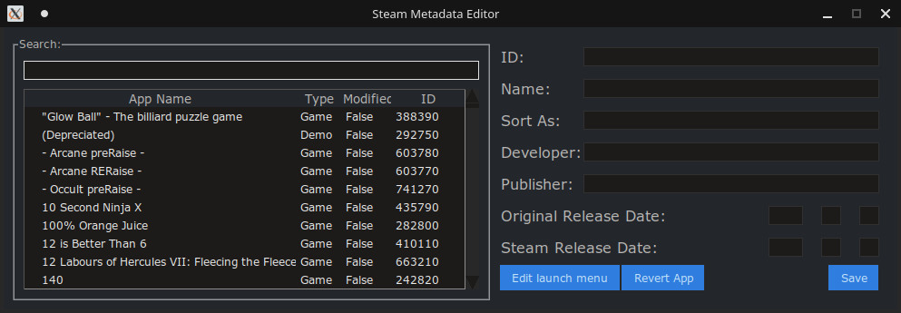
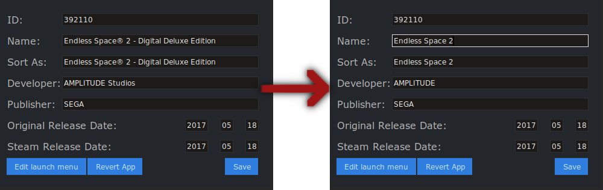
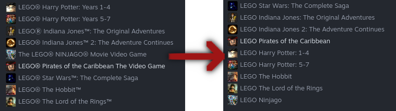
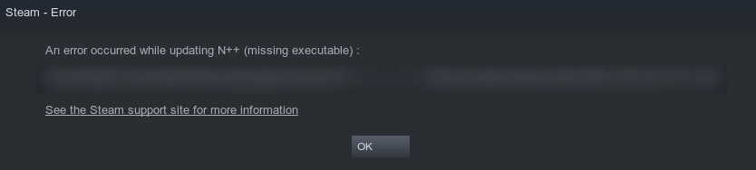
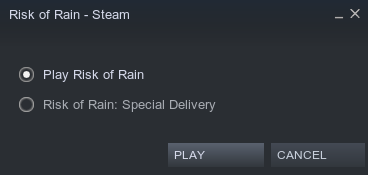
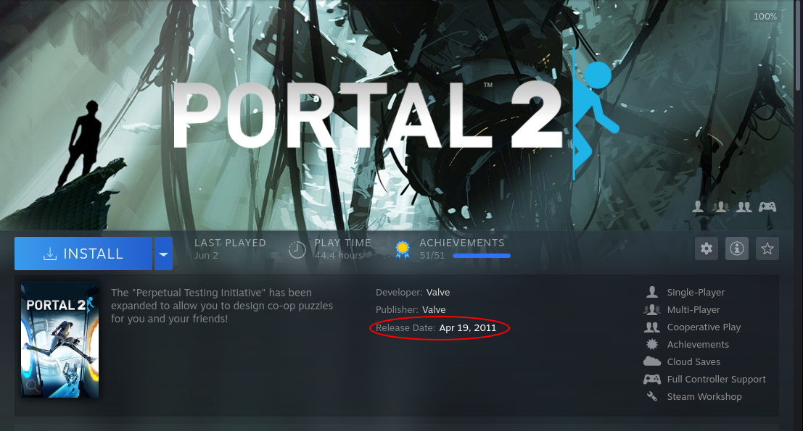
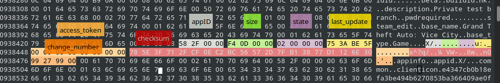

[](https://github.com/tralph3/Steam-Metadata-Editor/releases)
[](https://github.com/tralph3/ZeroTier-GUI/blob/master/LICENSE)
[](https://paypal.me/tralph3)
[](https://www.buymeacoffee.com/tralph3)

**Edit game titles, launch menus, and more with Steam Metadata Editor**

# Table of contents

---

## Introduction

Steam Metadata Editor is a powerful cross-platform application that lets you edit every single aspect of a Steam App. All the changes are local and are bound to be overwritten by Steam sooner or later. That's why the program keeps track of your changes, and can silently patch them back in if you configure it to do so.

The Editor features an easy to use GUI that lets you edit the most important aspects of the applications. If demand is high enough, more features will be added to the GUI. However, if there's anything that you would like to edit that's not possible through the GUI, you can always directly edit the data yourself by editing the JSON.

---

## Users
### Usage

When you launch the program, you should see something like this (note that the list of games depends on what you own):



To modify a game, you simply have to click on the one you want, and do your editing. You can use the bar at the top of the list to search for the game you want. In this example, we will edit **Endless Space 2**:



You can see I removed the "Registered" character and removed the "Digital Deluxe Edition" part. I also shortened the **Developer** section.

Once modifications are made, simply click **Save** and restart Steam.

And here are our modifications:


Easy huh? So what is it useful for?

## You can:

* Remove crap from game titles

* Order your list of games



* Fix missing executable errors



* Create your own launch menus, letting you seamlessly launch multiple modded installations from Steam



* Add missing information like release dates



* Any other modifcation you want through the JSON

---

## Developers
### How does it work?

The application is basically an easy way to modify a single file. Located in the folder **appcache** in the Steam installation, there's a file called **appinfo.vdf**. This is a binary file, meaning it's not easily readable, we can only see its bytes. Luckily, I was able to figure out exactly what everything means, with help of course.

### Understanding the layout

This file contains information for every application Steam ever had to download data for. These include all the applications in a user's library, and there may be others thrown in there for no particular reason.

The layout is pretty simple, the first 8 bytes are the header, they specify the version of the vdf file. The rest are the applications.

Applications have a header too, here's what everything means:

**NOTE: The names for these tags and most of this information is taken directly from [steamfiles](https://github.com/leovp/steamfiles)' source code. Big thanks to its developer.**



All of these values are stored in litte-endian notation. Right after the last byte in the header, the actual appinfo starts.

Now, this is basically a dictionary of nested dictionaries. Keys have a byte before them that determines the type of data they store. A `0x00` byte determines that it stores a dictionary (that's why the first byte after the last byte in the header is `0x00`), a `0x01` byte means it's a string, and a `0x02` byte means it's a 32-bit integer. There's also `0x07` bytes that represent 64-bit integers, however, I don't think those are used in the appdata. Then you get the name of the key, and another `0x00` byte to separate key from value. There's one last special byte, `0x08`, that determines a dictionary's end. You can see that at the end of every app, there's many of these bytes, signaling the end of many dictionaries.

This is known information, and nothing too complicated. The application just walks through every byte checking what they are and constructs a dictionary out of the data, the same way [steamfiles](https://github.com/leovp/steamfiles) does it (although a bit faster).

### Modifying data

If you try to just change the data to whatever you want, you'll realize that Steam will reject it and revert changes back. Why? The key lies in the `checksum` and `size` tags in the header. Both of these relate to the data directly, and must be updated for Steam to not reject the new data.

The `size` tag is pretty self explanatory, it's a 32-bit integer detailing how many bytes of data this application contains, counting from the very next section (`state`) to the very last `0x08` byte.

The `checksum` is of course generated with the data, but how? Simply throwing the bytes at some function won't do the trick. The data needs to be parsed in a specific format, but which? Well, you don't really think Valve uses this file in it's binary form right? No, their vdf files have a format that we can luckily see in other vdf files.

You see, there's two types of vdf files, binary ones, such as **appinfo.vdf**, and plain text ones, such as **localization.vdf**, located in the same directory. If we take a quick look at **localization.vdf**, we can see how the data is stored, here's a sample:

```
"localization"
{
	"english"
	{
		"store_tags"
		{
			"1663"		"FPS"
			"19"		"Action"
			"1693"		"Classic"
			"5547"		"Arena Shooter"
			"3859"		"Multiplayer"
			"1774"		"Shooter"
			"3878"		"Competitive"
			"6691"		"1990's"
        }
    }
}

```

You can see that everything is enclosed in double quotes, dictionaries break a line and increment indentation, and keys/values are separated by double tabs. And this is the exact format we need to parse **appinfo.vdf** to to get the checksum.

So what do we do exactly? We format all the modified data this way (the function `format_data` takes care of this in my program), and then pass the result through SHA-1, and we get the checksum.

## Special Thanks

Although I explained it all this gracefully, that doesn't mean I managed to discover it myself sadly. I connected the dots later, but the actual information was provided to me by *Tim Green*, creator of [Steam Edit](https://steamedit.tg-software.com/). My application intends to be a cross-platform and open-source alternative to it, but in no way do I intend to make it obsolete or discredit *Tim*, he has been a great help in the creation of this program.

I'd also like to thank [*Leonid*](https://github.com/leovp) for indirectly aiding me by making the source code of [steamfiles](https://github.com/leovp/steamfiles) freely available to anyone, it has greatly helped me understand how the file worked.
